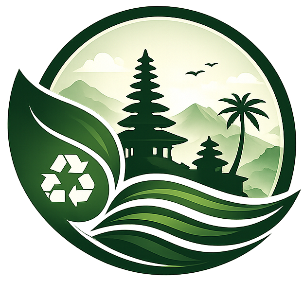

<div align="center">
  
  
  # BaliWasteAI 🌿
  
  **Real-Time Landfill Capacity Tracking & AI-Powered Waste Classification**  
  *Never guess where to throw your trash again.*
</div>

---

## 📖 Overview

**BaliWasteAI** is an intelligent, bilingual mobile-first web application designed to help citizens and businesses in Bali manage their waste disposal efficiently. 

By providing **real-time capacity data** of local landfills (TPS) and integrating **Google's Gemini 3.5 Flash AI** for instant waste classification, the app reduces the chance of rejected waste and overflowing bins.

## ✨ Core Features

1. **🗺️ Interactive Map (Peta)**
   - View real-time status and capacity of all TPS across Bali.
   - Built on robust Leaflet technology with mobile-friendly touch interactions.
   - Intelligent clustering and color-coded status badges.

2. **🤖 Smart AI Classification (Gemini 3.5 Flash)**
   - Capture photos directly from your browser or upload images.
   - Automatic image compression for low bandwidth usage.
   - The AI instantly classifies waste into Organic or Non-Organic and provides practical disposal tips based on your selected language.
   - Built-in rate limiting (5 requests/hour per IP) to prevent quota exhaustion.

3. **🔍 Instant Search (Cari)**
   - Search landfills by name, region, or address.
   - Dynamic real-time sorting and filtering.
   
4. **🔒 Secure Admin Dashboard**
   - Manage landfill statuses via a beautiful, password-protected dashboard.
   - Built with Next.js 15 Server Actions and HTTP-Only cookies.
   - Real-time client-side synchronization without page reloads using shared `localStorage` events.
   - Automatic Google Maps Shortlink (`goo.gl`) resolving into exact geographic coordinates.

5. **🌐 Bilingual Interface (i18n)**
   - Seamlessly switch between **English** and **Bahasa Indonesia**.
   - AI responses intelligently adapt to the selected language.

## 💻 Tech Stack

- **Framework**: [Next.js 16](https://nextjs.org/) (App Router)
- **Styling**: Modern Vanilla CSS + CSS Modules (Glassmorphism & Micro-animations)
- **AI Model**: `@google/generative-ai` (Gemini 3.5 Flash)
- **Map Engine**: `react-leaflet` / `leaflet`
- **i18n**: `next-intl`
- **Deployment**: Optimized for Vercel Serverless & Edge environments

## 🚀 Getting Started

### Prerequisites

Ensure you have Node.js 18+ installed on your machine.

### Installation

1. Clone the repository:
   ```bash
   git clone https://github.com/yanguswiradana/BaliWasteAI.git
   cd BaliWasteAI
   ```

2. Install dependencies:
   ```bash
   npm install
   ```

3. Configure Environment Variables:
   Create a `.env.local` file in the root directory and add the following keys:
   ```env
   # Your Google Gemini API Key
   GEMINI_API_KEY=your_gemini_api_key_here
   
   # Admin Dashboard Credentials
   ADMIN_EMAIL=admin@baliwaste.com
   ADMIN_PASSWORD=securepassword123
   ```

4. Run the development server:
   ```bash
   npm run dev
   ```

5. Open [http://localhost:3000](http://localhost:3000) in your browser.

## 🤝 Contributing

Contributions are welcome! Please feel free to submit a Pull Request.

---
<div align="center">
  <i>Developed with ❤️ for a cleaner Bali.</i>
</div>
